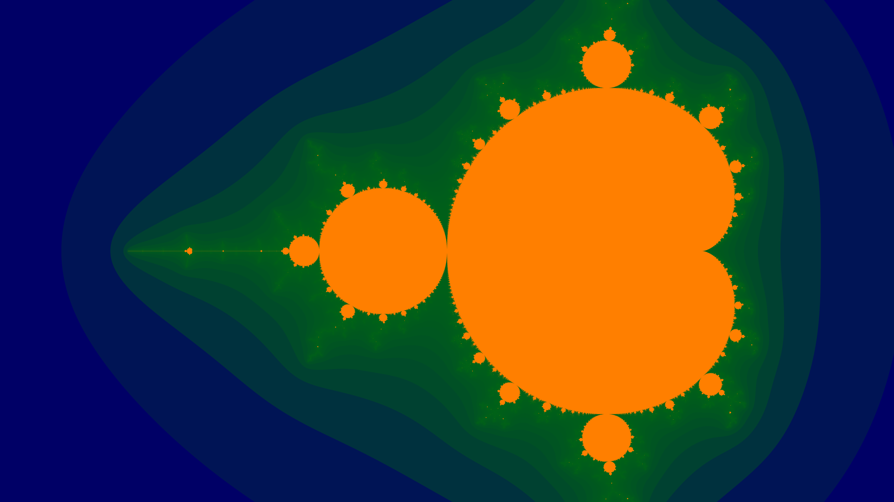

## Mandelbrot Fractal

# This is a small python script that can generate a Mandelbrot Fractal or given parts of it and save it into png.

Via command line arguments you can define the size of the generated image, the accuracy of the generation (iteration count) and the area to be magnified

Below is an example generated by the script:

